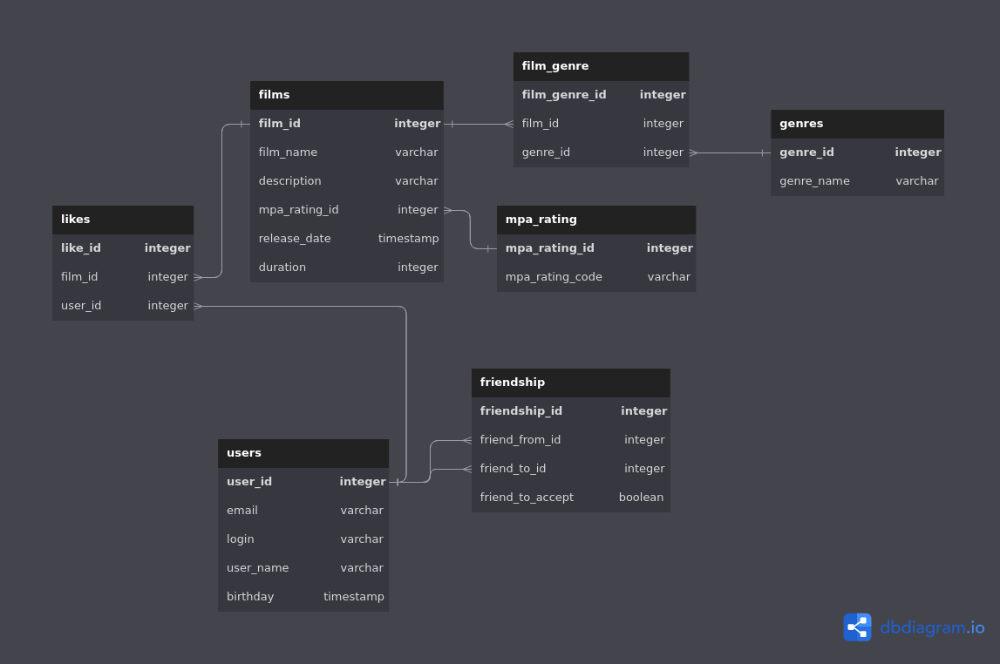

# Описание базы данных проекта
## Схема базы данных


## Список основных запросов
### Получение списка всех фильмов 
```
SELECT f.film_id, f.film_name, f.description, r.mpa_rating_name, f.release_date, f.duration   
FROM film f
LEFT JOIN mpa_rating r ON f.mpa_rating_id = r.mpa_rating_id
```
### Получение списка всех пользователей
```
SELECT * FROM user
```
### Список общих подтвержденных друзей с другим пользователем
```
SELECT f1.friend_to_id 
FROM friendship f1
JOIN friendship f2 ON (f1.friend_to_id = f2.friend_to_id)
WHERE f1.friend_from_id = me_id
AND f2.friend_from_id = other_user_id 
AND f1.friend_to_accept
AND f2.friend_to_accept
```
где me_id - мой идентификатор, other_user_id - идентификатор другого аользователя 
### Получение списка 10 лучших фильмов
```
SELECT f.film_id, f.film_name, COUNT(l.like_id) as count_like
FROM film f
LEFT JOIN likes l ON f.film_id = l.film_id
GROUP BY f.film_id
ORDER BY count_like DESC
LIMIT 10
```